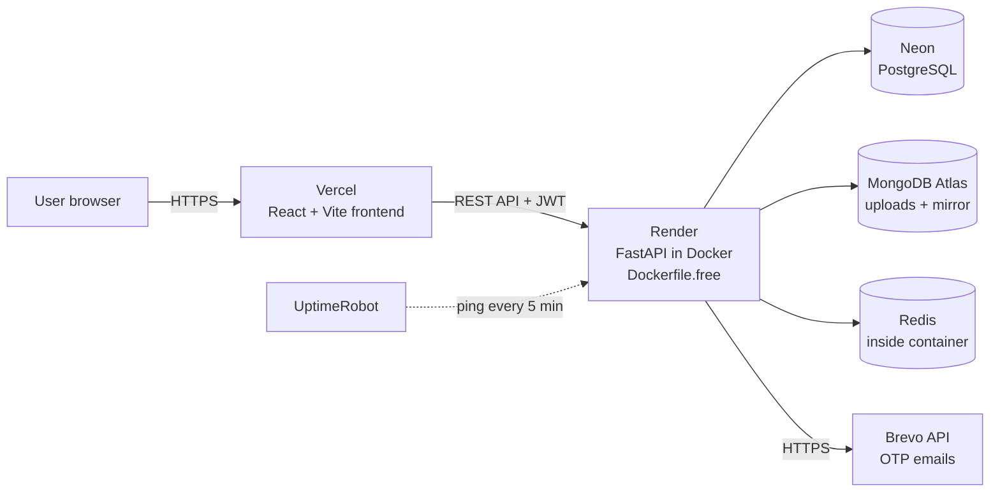

# 🏠 PropAI : AI-Driven Financial Analytics for Property Management

> A full-stack intelligent property management platform combining OCR, NLP, KNN-based rent comparison, and expense forecasting.

[](LICENSE)


**Repository:** [github.com/SamruddhiKadam2023in/PropAI](https://github.com/SamruddhiKadam2023in/PropAI)

---

## 📌 About the Project

PropAI automates financial document processing, predicts rental market trends, and streamlines the complete tenant–owner–manager workflow. It supports three user roles **Tenant**, **Owner**, and **Manager** each with a dedicated dashboard and its own set of features.

---

## 🛠️ Tech Stack

| Layer | Technology |
|---|---|
| Backend | FastAPI, SQLAlchemy, PostgreSQL, MongoDB, Redis |
| Frontend | React 18, Vite, Tailwind CSS, Recharts |
| AI / ML | Tesseract OCR, OpenCV, spaCy, scikit-learn, pypdfium2 |
| Reports | ReportLab (PDF), openpyxl (Excel) |
| Auth | JWT access tokens + rotating refresh tokens, bcrypt, email one-time codes (OTP) |
| Email | SMTP (Gmail) or Brevo's web API |
| Deploy | Docker Compose, Nginx, Caddy (HTTPS), Vercel (website), Render / Oracle Cloud (API), Neon, MongoDB Atlas |

---

## ✨ Features by Role

### 🧑‍💼 Tenant

- Dashboard with property info and payment history
- Payments page: what's due this month, record a payment, transaction history with receipts
- Rental agreement view, including any amount still owed after leaving early
- Document upload — OCR reads English and Marathi bills, classifies the document, and extracts type, vendor, amount, bill date, due date, billing period, and address (PIN, suburb, city, state)
- Cost analysis with expense trends and next-month forecast — **filled automatically from uploaded utility bills** (electricity, water, gas)
- **Find a Home**: search available properties and apply to rent
- Rental application status tracking (Pending / Approved / Rejected)
- In-app notifications and messaging with the owner

### 🏢 Owner

- Portfolio dashboard with occupancy rate and income summary
- Add, edit, and manage properties
- Review incoming rental applications and approve or reject them
- Analytics powered by KNN market rent comparison
- Download PDF and Excel financial reports
- Messaging with tenants
- Maintenance requests, service records and fees, and a directory of repair contacts
- Agreements: record the rent and term for a tenant, and record a tenant leaving early

### 🛡️ Manager

- Platform wide dashboard with all users, properties, and rent stats
- Manage users and assign roles
- View and action all rental applications across all properties
- Rent collection tracker (by month or date range)
- Download PDF and Excel reports for all properties, or for a single property
- Add users (Tenant, Owner, or Manager), deactivate or reactivate accounts, and review all agreements

---

## 🔄 How the Rental Flow Works

| Step | Action |
|:---:|---|
| 1 | Tenant browses available properties and clicks **Apply to Rent** |
| 2 | Owner receives a bell notification — *New Rental Application* |
| 3 | Manager receives the same notification |
| 4 | Owner or Manager opens the **Applications** page |
| 5 | They click **Approve** or **Reject** |
| 6 | Tenant immediately receives a notification with the outcome |
| 7 | On approval, the property is automatically marked as **Occupied** |

---

## 📂 Project Structure

```
PropAI/
├── backend/
│   ├── app/
│   │   ├── main.py            # Entry point, CORS, routers
│   │   ├── config.py          # Settings and environment variables
│   │   ├── database.py        # PostgreSQL, MongoDB, Redis connections
│   │   ├── models/            # SQLAlchemy database models
│   │   ├── schemas/           # Pydantic request and response schemas
│   │   ├── routers/           # All API endpoints
│   │   ├── ml/                # OCR pipeline, KNN, regression, NLP
│   │   ├── services/          # OCR service, report generation, listings
│   │   └── utils/             # Auth helpers, cache, dependencies
│   ├── seed.py                # Sample data loader (refuses to run when DEBUG=false)
│   ├── create_manager.py      # Creates the first Manager on a live server
│   ├── requirements.txt
│   ├── Dockerfile             # Normal image (full bill reader)
│   └── Dockerfile.free        # Image for free 512 MB hosts (lite bill reader)
├── frontend/
│   ├── src/
│   │   ├── pages/             # Tenant, Owner, Manager dashboards
│   │   ├── components/        # Layout, Charts, DocumentUpload
│   │   ├── contexts/          # Auth and Theme state
│   │   └── services/          # Axios API client
│   ├── Dockerfile
│   └── nginx.conf
├── deploy/                    # Production setups and guides (Oracle server, free hosts, Caddy)
├── tests/                     # End-to-end API and browser tests (see tests/README.md)
├── docker-compose.yml         # Local demo stack
├── render.yaml                # Optional paid Render blueprint
├── LICENSE                    # MIT
└── README.md
```

---

## ⚙️ Requirements

Make sure the following are installed on your machine:

- [Docker Desktop](https://www.docker.com/products/docker-desktop)
- [Git](https://git-scm.com/download/win)

---

## 🚀 Getting Started

Follow these steps in order.

**1. Clone the repository**

```bash
git clone https://github.com/SamruddhiKadam2023in/PropAI.git
```

**2. Go into the project folder**

```bash
cd PropAI
```

**3. Start all services using Docker**

> The first run takes 5–8 minutes to download and build everything.

```bash
docker compose up --build -d
```

This starts 5 services automatically:

| Service | Address |
|---|---|
| Backend API | http://localhost:8000 |
| Frontend app | http://localhost:3000 |
| PostgreSQL | port 5432 |
| MongoDB | port 27017 |
| Redis | port 6379 |

**4. Load sample data into the database**

```bash
docker exec property_backend python seed.py
```

**5. Open the app in your browser**

```
http://localhost:3000
```

---

## 🔑 Login Credentials (after running seed)

| Role | Email | Password |
|---|---|---|
| Tenant | amit@example.in | PropAI@2024 |
| Owner | vikram@propai.in | PropAI@2024 |
| Manager | rajesh@propai.in | PropAI@2024 |

You can also register a new **Tenant** or **Owner** account. Sign-up requires a one-time code emailed to you (see [Sign-in, Sign-up and Email Codes](#-sign-in-sign-up-and-email-codes)). Manager accounts cannot be created via sign-up — an existing Manager adds them under **Users & Roles → Add user**.

> ⚠️ **Warning:** These are demo/seed credentials for local development only. Replace or remove them entirely before any public or production deployment.

---

## 📅 Daily Usage

| Action | Command |
|---|---|
| Start the project | `docker compose up -d` |
| Stop the project (data is saved) | `docker compose stop` |
| View backend logs | `docker compose logs -f backend` |

---

## 🌐 Environment Variables

A sample environment file is provided at `backend/.env.example`. Copy it to `backend/.env` before running locally:

```bash
# Windows
copy backend\.env.example backend\.env

# macOS / Linux
cp backend/.env.example backend/.env
```

The default values work with Docker out of the box — no changes are needed for local development. To receive emailed one-time codes, add your mail settings (`SMTP_*`); see [Email Setup](#email-setup-gmail-example).

**For production, update these values:**

| Variable | Purpose |
|---|---|
| `DATABASE_URL` | PostgreSQL connection string |
| `MONGODB_URL` | MongoDB connection string |
| `REDIS_URL` | Redis connection string |
| `SECRET_KEY` | A long random secret string |
| `SMTP_HOST` / `SMTP_PORT` / `SMTP_USERNAME` / `SMTP_PASSWORD` / `SMTP_FROM` | Outgoing email for one-time codes |
| `DEBUG` | Set to `false` (`true` prints every SQL statement, including password hashes, in the logs) |
| `FRONTEND_URL` | The website's address (the only origin allowed to call the API) |
| `CONFIDENCE_THRESHOLD` | Minimum OCR confidence (default `0.65`) |
| `BREVO_API_KEY` | Send code emails through Brevo's web API instead of SMTP (for hosts that block SMTP ports) |
| `OCR_LITE_MODE` | `true` on tiny hosts (512 MB): lighter, safer bill reading (default `false`) |
| `OCR_LANGUAGES` | Languages Tesseract reads, e.g. `eng+mar` (default) or `eng` |
| `MIRROR_UPLOADS_TO_MONGO` | `true` on hosts whose disk is wiped on restart: keeps a copy of every upload in MongoDB |
| `BOOTSTRAP_MANAGER_EMAIL` / `_NAME` / `_PASSWORD` | Creates the first Manager at start-up when no Manager exists (for hosts with no terminal). Delete them after your first sign-in |

> The **Quick Demo Login** panel on the Login page is shown only when `frontend/.env` contains `VITE_SHOW_DEMO_LOGIN=true` (copy `frontend/.env.example` to `frontend/.env` for a local demo). **Public builds must not set it** — without it, the build contains no panel and no demo password.

---

## 🔐 Sign-in, Sign-up and Email Codes

- **Sign-up** (Tenant or Owner only) creates an unverified account and emails a 6-digit code. You're signed in only after entering it.
- **Codes** last 10 minutes, work once, and lock after 5 wrong guesses. "Resend code" waits 60 seconds (max 5 per hour).
- **Forgot password?** on the Login page emails a reset code the same way. A reset signs you out everywhere.
- **Passwords** must be at least 8 characters (at most 72 bytes) — enforced on both the server and the forms.
- **Rate limiting:** 5 wrong passwords for the same email from the same address within a minute are blocked for the rest of that minute (HTTP 429).
- **Tokens:** access tokens last 15 minutes and renew silently; the refresh token lasts 7 days, is replaced on every use, and is revoked by Sign Out, a password reset, or if an already-used one is presented again.
- **Manager-created accounts:** Managers create other accounts (including other Managers) at **Manager → Users & Roles → Add user**.
- **Account settings:** everyone can open it (click your name at the bottom of the sidebar) to edit their name and phone and to change their password. Changing the password signs out all other devices. Email and role can't be changed there.
- **Deactivation:** Managers can deactivate and reactivate other accounts under **Users & Roles**. A deactivated person is signed out on their next action and cannot sign in until reactivated; their data is kept. A Manager cannot deactivate themselves.

### Email Setup (Gmail example)

1. On the Gmail account, turn on 2-Step Verification, then create an App password at [myaccount.google.com/apppasswords](https://myaccount.google.com/apppasswords). It is 16 letters shown once — remove the spaces when you copy it.
2. In `backend/.env`, set:

   ```env
   SMTP_HOST=smtp.gmail.com
   SMTP_PORT=587
   SMTP_USERNAME=your.address@gmail.com
   SMTP_PASSWORD=<the 16 letters, no spaces>
   SMTP_FROM="PropAI <your.address@gmail.com>"
   ```

3. Apply the change:

   ```bash
   docker compose up -d --force-recreate backend
   ```

**Hosts that block SMTP** (Render free, Hugging Face): set `BREVO_API_KEY` instead. Create a free [Brevo](https://www.brevo.com) account, verify your sender address, generate an API key, and set `SMTP_FROM` to `PropAI <your verified address>`. Codes are then sent over HTTPS.

If neither `SMTP_HOST` nor `BREVO_API_KEY` is set, the server sends nothing and the sign-up screen says the code could not be sent. For development only, you can set `EMAIL_DEV_LOG_CODES=true` to print codes in the backend log (`docker compose logs backend`).

> ⚠️ **Never enable `EMAIL_DEV_LOG_CODES` in production.**

---

## 🧾 Reading Bills (English + Marathi)

Uploaded bills are read in the background by `backend/app/ml/bill_pipeline.py`. Tesseract (English + Marathi) runs on several cleaned-up copies of the image, then rules identify:

- Type, vendor, and amount to pay
- Bill date, due date, and billing period
- Address (6-digit PIN checked against its state, suburb/city, with the name kept apart from the address)

The reader stops as soon as it is confident, within 60 seconds. Anything it is unsure about is left **empty** (never guessed), and the document is marked **"flagged"** so the user can correct it. If the new reader finds nothing, the older pipeline is used as a fallback.

The Marathi language pack is installed in the backend image (`backend/Dockerfile`). After pulling this change, run:

```bash
docker compose build backend
docker compose up -d --force-recreate backend
```

### PDFs downloaded straight from a utility's website

A PDF with a real, selectable text layer (most bills downloaded from a discom's portal or emailed as a receipt) is read from that text directly — no OCR, no misread digits, exact even in Marathi, and usually under a second. Only photographed or scanned PDFs go through Tesseract. A PDF whose text doesn't look like a bill at all (an unrelated document with a text layer) falls back to OCR on the rendered page.

### Lite mode (small free hosts)

A free host with 512 MB of memory and a fraction of a CPU can't run the full reader (measured: it hits the memory limit and takes over 2 minutes per bill). Setting `OCR_LITE_MODE=true` (already set in `backend/Dockerfile.free`):

- Reads one Tesseract pass at a time on a smaller picture
- Loads no spaCy model
- Stops as soon as the essentials are read (about 260–290 MB peak, 10–80 seconds)

The trade-off is deliberate: lite mode only accepts an amount it saw **twice next to a label**. Otherwise the amount stays empty and the bill is marked "Needs review", so a wrong amount is never shown. Clear English bills read completely; Marathi bills usually give the address, dates, type, and vendor, and the user types the amount once. Set `OCR_LANGUAGES=eng` to skip Marathi on a very slow host.

### Bills feed the Cost Analysis

When a bill finishes reading with a type (electricity, water, or gas), an amount, and a date, it becomes an **expense on the tenant's property**, so the charts and trends fill themselves.

- Correcting a bill's amount, date, or type updates its expense.
- Deleting the bill deletes its expense.
- A bill that still needs review creates no expense.

### Known limits

- Very low-resolution photos are flagged instead of read.
- The place list in `backend/app/ml/india_places.py` covers major cities and suburbs and can be extended.
- The test bills in `tests/assets/bills/` are invented samples. **Never add a real person's bill to the repository.**

---

## 🚢 Deployment

PropAI is deployed on a **free, no-card stack**: **Vercel** (website) + **Render** (API) + **Neon** (PostgreSQL), with MongoDB Atlas, Redis (inside the API container), and Brevo for email.

### Architecture



### Services Used

| Component | Service | Role | Plan |
|---|---|---|---|
| Frontend | **Vercel** | Hosts the React/Vite website | Free |
| Backend API | **Render** | Runs FastAPI via `backend/Dockerfile.free` (512 MB, lite OCR) | Free web service |
| PostgreSQL | **Neon** | Users, properties, payments, agreements | Free |
| MongoDB | **MongoDB Atlas** | Document store and upload mirror | Free (M0) |
| Redis | In-container | Cache and rate limiting | — |
| Email | **Brevo** (web API) | Sign-up and reset codes (Render free blocks SMTP) | Free |
| Keep-alive | **UptimeRobot** | Stops the free API from sleeping | Free |

### Step 1 — Create the PostgreSQL database (Neon)

1. Create a new Neon project and database.
2. Copy the **connection string** and make sure it ends with `?sslmode=require`.
3. Keep it for the `DATABASE_URL` variable (Step 3). Use the same URL format shown in `backend/.env.example`.

### Step 2 — Create the MongoDB database (Atlas)

1. Create a free **M0** cluster and a database user (username and password).
2. Under **Network Access**, allow `0.0.0.0/0` (Render's free tier has no fixed outbound IP).
3. Copy the connection string for `MONGODB_URL`.

### Step 3 — Deploy the API (Render)

1. In Render, choose **New → Web Service** and connect the GitHub repo.
2. Configure:

   | Setting | Value |
   |---|---|
   | Runtime | Docker |
   | Root directory | `backend` |
   | Dockerfile path | `Dockerfile.free` |
   | Instance type | Free |

3. Add these **environment variables**:

   | Variable | Value |
   |---|---|
   | `DATABASE_URL` | Neon connection string (Step 1) |
   | `MONGODB_URL` | Atlas connection string (Step 2) |
   | `REDIS_URL` | Leave at the default — Redis runs inside the container |
   | `SECRET_KEY` | Random string, 32+ characters |
   | `DEBUG` | `false` |
   | `FRONTEND_URL` | Your Vercel URL (set it after Step 5, then redeploy) |
   | `BREVO_API_KEY` | From Step 4 |
   | `SMTP_FROM` | `PropAI <your verified Brevo sender>` |
   | `OCR_LITE_MODE` | `true` (already set in `Dockerfile.free`) |
   | `MIRROR_UPLOADS_TO_MONGO` | `true` (Render's disk is wiped on restart) |
   | `BOOTSTRAP_MANAGER_EMAIL` / `_NAME` / `_PASSWORD` | Creates the first Manager (Step 6) |

4. Deploy. When the build finishes, open `https://<your-service>.onrender.com/docs` to confirm the API is up.

> ℹ️ The app **refuses to start** with `DEBUG=false` if `SECRET_KEY` is the placeholder or under 32 characters.

### Step 4 — Set up email (Brevo)

1. Create a free Brevo account and **verify your sender address**.
2. Generate an **API key** and add it to Render as `BREVO_API_KEY`.
3. Set `SMTP_FROM` to `PropAI <your verified address>`. Codes are sent over HTTPS, so Render's blocked SMTP ports don't matter.

### Step 5 — Deploy the website (Vercel)

1. In Vercel, choose **Add New → Project** and import the same GitHub repo.
2. Configure:

   | Setting | Value |
   |---|---|
   | Framework preset | Vite |
   | Root directory | `frontend` |
   | Build command | `npm run build` |
   | Output directory | `dist` |

3. Add the environment variable that points the frontend at your API (the Render URL, e.g. `https://<your-service>.onrender.com`). Check `frontend/.env.example` for the exact variable name.
4. **Do not set `VITE_SHOW_DEMO_LOGIN`** — public builds must contain no demo-login panel or demo password.
5. Deploy, then copy the Vercel URL back into Render's `FRONTEND_URL` and redeploy the API so CORS allows the site.

### Step 6 — Create the first Manager

- **No terminal on Render free:** use the `BOOTSTRAP_MANAGER_EMAIL`, `_NAME`, and `_PASSWORD` variables. The Manager is created at start-up when none exists. Sign in once, then **delete these three variables**.
- **With a terminal:** run `python create_manager.py`.
- ❌ **Never run `seed.py` on a live server** — it deletes all data (it refuses to run when `DEBUG=false`).

### Step 7 — Keep the free API awake

Render's free web service sleeps after about 15 minutes idle. Add an **UptimeRobot** HTTP monitor pointing at `https://<your-service>.onrender.com/docs` with a 5-minute interval.

### Step 8 — Verify the deployment

| Check | Expected result |
|---|---|
| `https://<api>/docs` | Swagger UI loads |
| Open the Vercel site | Login page, no demo-login panel |
| Sign up as Tenant/Owner | 6-digit code arrives by email |
| Sign in as the Manager | Dashboard loads |
| Upload an English bill (Tenant) | Fields extracted, or marked "Needs review" |

### Redeploying / Updating

| Part | How |
|---|---|
| Frontend | Push to GitHub — Vercel rebuilds automatically |
| Backend | Push to GitHub — Render rebuilds automatically (or use **Manual Deploy**) |
| Env var change | Edit in the Render/Vercel dashboard and redeploy |

### Troubleshooting

| Problem | Likely cause and fix |
|---|---|
| API won't start | `SECRET_KEY` is placeholder or under 32 chars while `DEBUG=false` |
| Browser shows CORS errors | `FRONTEND_URL` on Render doesn't exactly match the Vercel URL |
| Frontend can't reach the API | The API URL variable on Vercel is missing or wrong — rebuild after fixing |
| No sign-up code email | `BREVO_API_KEY` missing, or sender not verified in Brevo |
| Database connection error | Neon URL missing `sslmode=require`, or Atlas network access not open |
| Very slow first load | Free API was asleep — add or check the UptimeRobot monitor |

## 🧪 Running the Tests

Real end-to-end tests (API + real browser) live in the `tests/` folder — about 31 suites and 1,240 checks covering sign-in, agreements and payments, bill reading, hosting features, exports, and every page. See `tests/README.md`.

```bash
pip install -r tests/requirements.txt
cd tests && npm install && cd ..
python tests/run_all.py
```

---

## 📖 API Documentation

Once the backend is running, open either of these in your browser:

| Docs | URL |
|---|---|
| Swagger UI | http://localhost:8000/docs |
| ReDoc | http://localhost:8000/redoc |

---

## 📄 License

Released under the **MIT License** — see [`LICENSE`](LICENSE). You may use, modify, and distribute it, keeping the copyright notice.

---

## 🙌 Built With

FastAPI · React · PostgreSQL · MongoDB · Redis · Tesseract OCR · spaCy · scikit-learn
